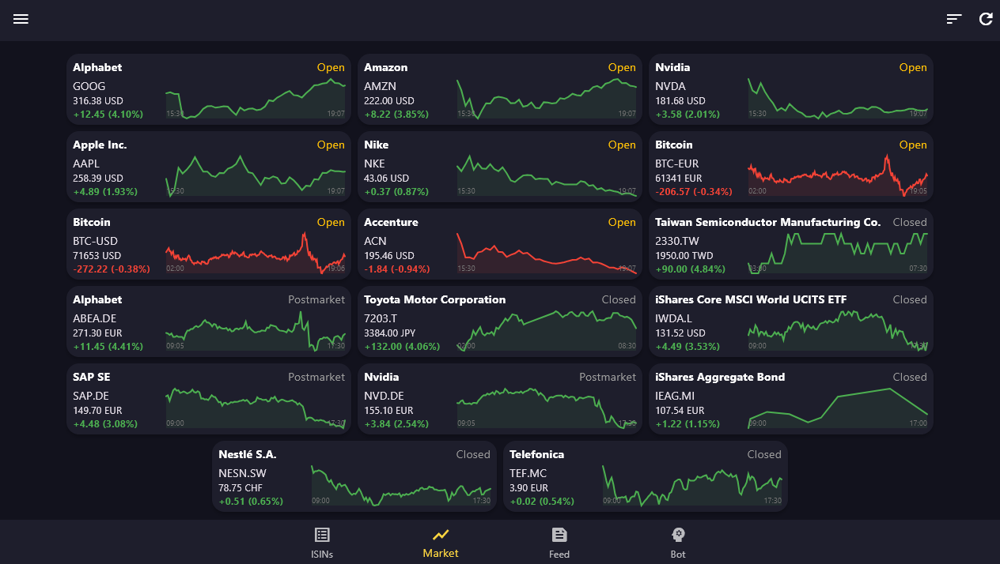
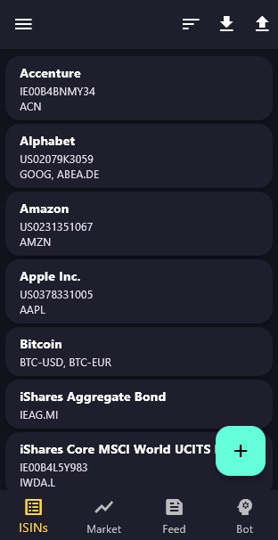
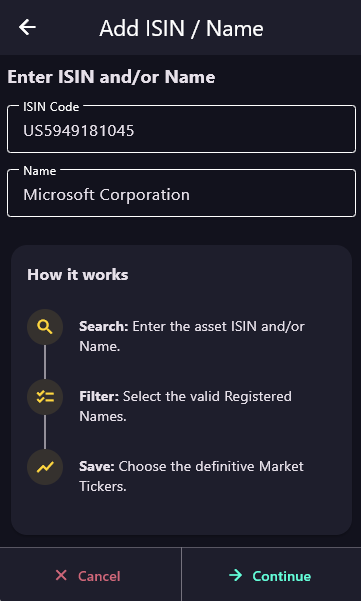
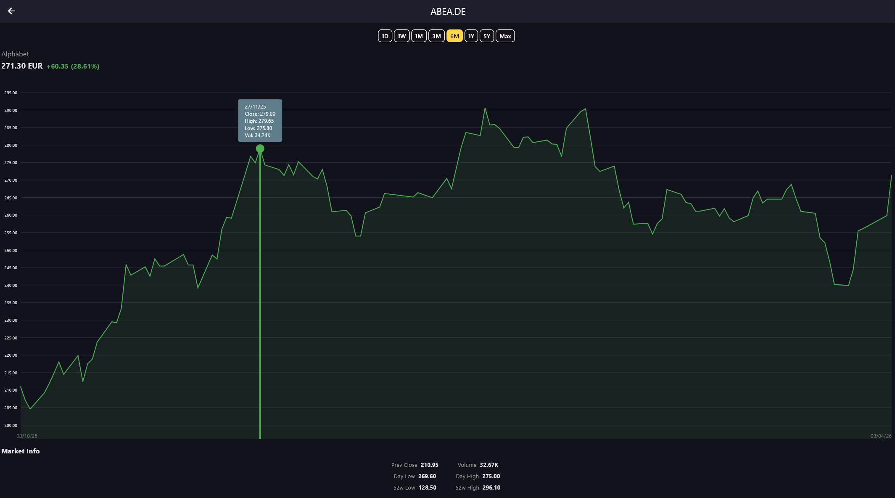
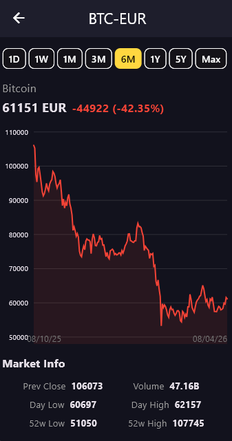
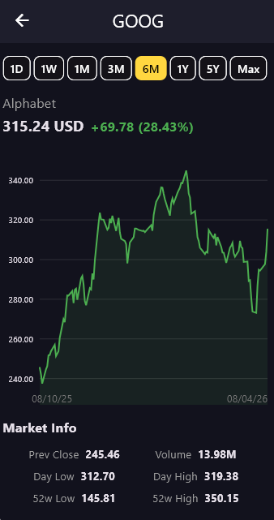
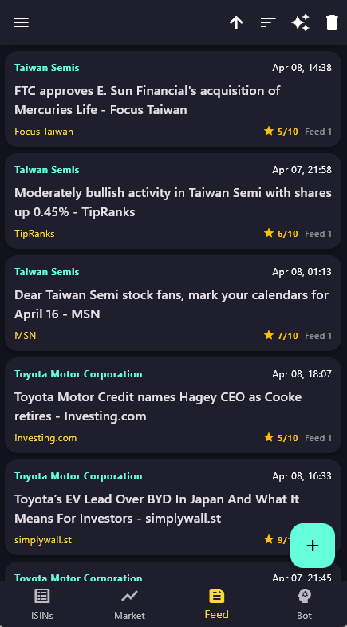
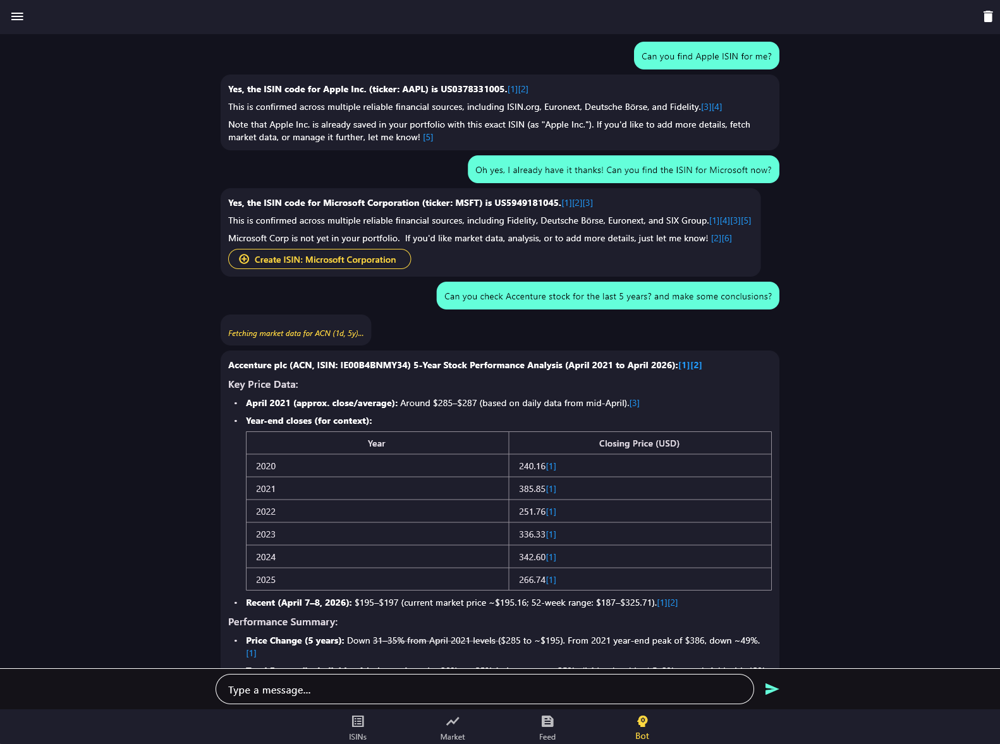
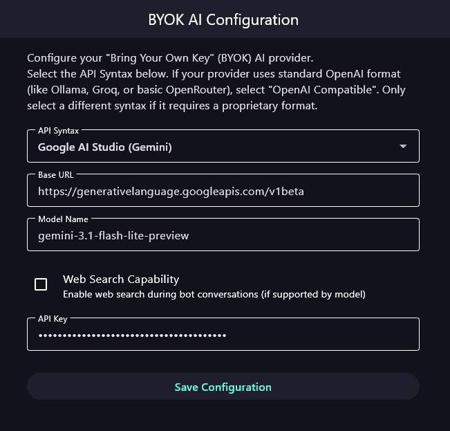
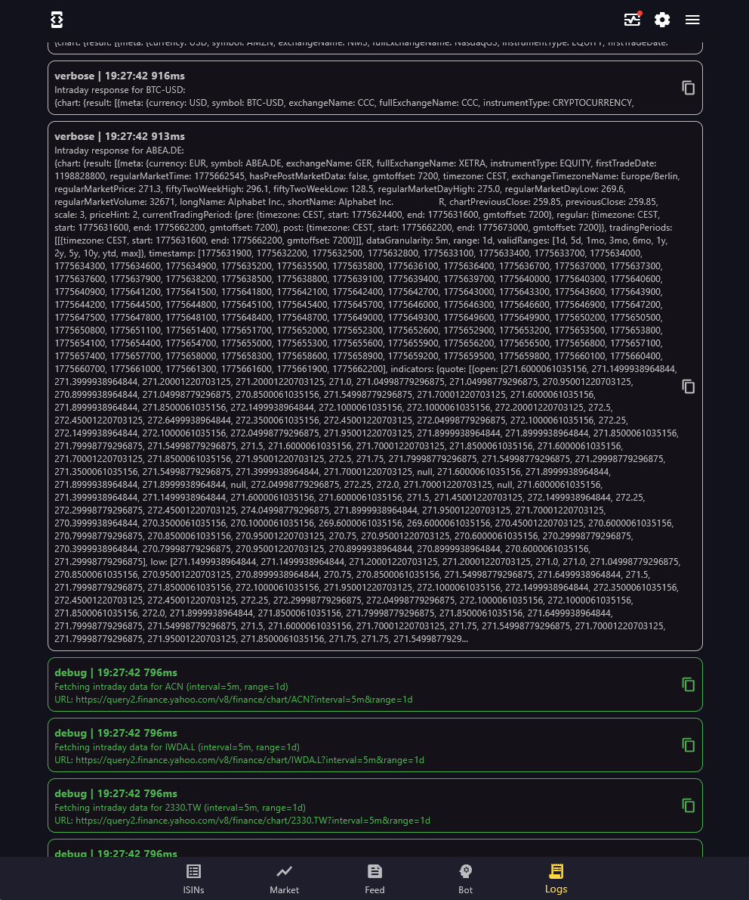

# Pocket ISINs

## 1. General Description
**Pocket ISINs** is a hybrid (Android/Windows/Mac) responsive application (mobile/tablet/PC), designed to effortlessly discover, track, and analyze financial assets and news using traditional free APIs (Yahoo Finance, Google RSS) and AI models through a BYOK (Bring Your Own Key) architecture.

**Key Features:**
* **Intuitive Ticker Discovery:** A step-by-step wizard that easily finds accurate tickers for any given asset name or ISIN.
* **Live Market Dashboard:** A centralized hub to monitor real-time quotes and the current status of all tracked tickers.
* **Detailed Historical Charts:** Interactive graphical views to analyze asset performance across customizable timeframes.
* **AI-Powered News Feed:** Aggregates asset-related news via Google RSS and utilizes artificial intelligence to analyze, score, and rank articles based on their relevance.
* **Chatbot with Custom Tools:** An integrated chatbot equipped with custom tools, enabling it to directly call Yahoo Finance APIs and execute native actions within the application's interface.
* **Advanced Inspection Console:** A log console can be enabled to visualize the specific details of API and AI model requests and responses, and to review application events and errors.

### Technology Stack
* **Framework:** `Flutter/Dart` - 100% Client-Side execution.
* **State Management:** `Riverpod`
* **Data Persistence:** `Drift`
  * **Secure Storage:** `flutter_secure_storage`
* **Financial Data Provider:** Public Yahoo Finance API
* **Logging:** `talker_flutter`

  

---

## 2. Artificial Intelligence Integration (BYOK)
Pocket ISINs utilizes a **"Bring Your Own Key" (BYOK)** model. The app itself does not have a proprietary backend or server; all AI orchestration happens locally on the device.

The app provides a universal HTTP connector based on standard API syntaxes (like OpenAI's `/v1/chat/completions`). Users can configure their own base URL, Model Name, and API Key to connect to providers like OpenAI, OpenRouter, or any compatible endpoint.

### How to get a free key?
If you want to use the AI features (like news analysis and the smart bot) without paying for API usage, you can obtain a free key from **Google AI Studio**. 

Currently, Google AI Studio offers a generous free tier with a limited number of requests per minute/month for their Gemini models. However, web search capabilities are disabled in this free tier.
*(This information is valid as of **April, 2026**).*

---

## 3. Core Features & Screens

### 3.1 ISINs (Asset Management)
This is the main hub for listing, adding, and editing your tracked assets. 
* **Smart Wizard:** Adding a new asset triggers a step-by-step wizard. You can input an ISIN or an asset name, and the wizard will search the Yahoo Finance API to find the exact matching market symbols.
* **Details View:** Clicking on any tracked ISIN opens a detailed card with asset information and the option to re-run the wizard to update or edit its market tickers.

  
  &nbsp;&nbsp;&nbsp;&nbsp;
  

### 3.2 Market
A dedicated space to monitor the active tickers associated with your ISINs.
* **Live Tracking:** Lists all discovered tickers with their current market status.
* **Interactive Charts:** Tapping on a ticker opens a detailed chart view, allowing you to select different historical time ranges (1D, 1W, 1M, 6M, etc.) to analyze the asset's performance.

  

  
  &nbsp;&nbsp;&nbsp;&nbsp;
  

### 3.3 Feed (AI-Powered News)
An intelligent news aggregator built directly into the app.
* **Google RSS Integration:** Automatically fetches news articles related to your saved assets based on their names.
* **AI Sentiment & Scoring:** You can trigger the configured AI to read the fetched news items and assign them an "Economic Relevance" score from 1 to 10. 
* **Sorting:** Easily filter and sort the news feed by relevance, ensuring you only read the headlines that actually impact the market.

  

### 3.4 Bot (Intelligent Assistant)
A conversational interface that goes beyond standard chat. The bot is deeply integrated with the app's internal functions using tool calling.
* **Actionable Commands:** You can ask the bot to fetch market data for a specific timeframe.
* **UI Interactions:** If you ask the bot to research a new ISIN, it can search the web (if supported by your BYOK provider) and generate an actionable UI button within the chat. Clicking this button directly opens the "Add ISIN" wizard with all the gathered data pre-filled.

  

### 3.5 Settings & Logs
* **BYOK Configuration:** Easily input and securely store your API credentials and preferred model syntax.
* **Developer Mode (Logs):** A hidden logging section built with `talker_flutter`. It displays verbose details of HTTP calls, Yahoo Finance API responses, AI context handling, tool execution, and error tracking to help debug the application.

  

  

